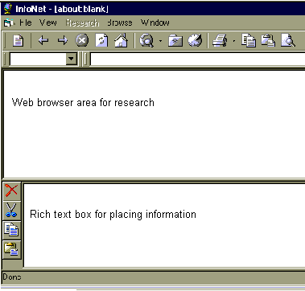



## InfoNet

### Description

Great research tool for the internet. Uses an MDI format to view as many web pages your system memory allows, drag-n-drop information from the browser to a textbox. Built in Web page maker too!

Some of the code has been taken from different apps in PSC, so thanks to all those who contributed.

To use this code, you will need VB6 (VB5 will do also, if you know how to make a flat toolbar), VB Service Pack 4, Coolbar control and the DHTML Editor control.

Still working on the toolbars and Menus, but for the most part, it's functioning well. Read the ReadMe file and Bug report included in the zip. I haven't commented the code and did a sloppy job writing it (no indents, lots of code commented out, etc.) but it's still under development. You can add what you want, delete what you want. Just have fun with it!
 
### More Info
 

             |
---                |---
**Submitted On**   |2001-01-24 12:31:50
**By**             |[Syllva Tech Software](https://github.com/Planet-Source-Code/PSCIndex/blob/master/ByAuthor/syllva-tech-software.md)
**Level**          |Intermediate
**User Rating**    |4.4 (40 globes from 9 users)
**Compatibility**  |VB 6\.0
**Category**       |[Internet/ HTML](https://github.com/Planet-Source-Code/PSCIndex/blob/master/ByCategory/internet-html__1-34.md)
**World**          |[Visual Basic](https://github.com/Planet-Source-Code/PSCIndex/blob/master/ByWorld/visual-basic.md)
**Archive File**   |[CODE\_UPLOAD141171242001\.zip](https://github.com/Planet-Source-Code/syllva-tech-software-infonet__1-14673/archive/master.zip)

